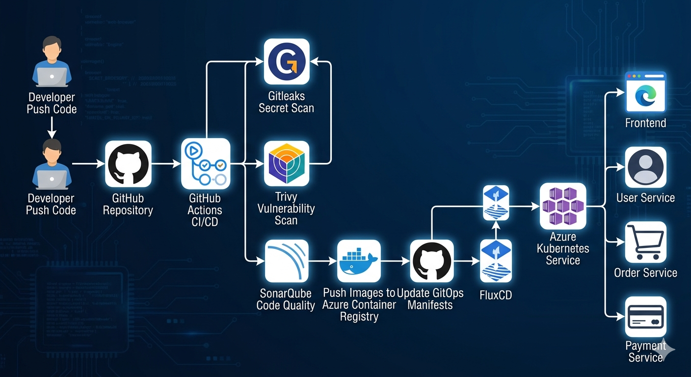

# 🚀 DevOps Microservices Platform (AKS + GitOps + CI/CD)

A **cloud-native DevOps project** demonstrating an end-to-end workflow for building, scanning, containerizing, and deploying microservices using **CI/CD and GitOps**.

The system automatically builds Docker images, performs security scans, pushes images to the container registry, and deploys them to Kubernetes using GitOps.

---

# 📌 Project Overview

This project demonstrates a **modern DevOps architecture** using:

• Microservices
• Containerization
• Continuous Integration / Continuous Deployment
• DevSecOps security scanning
• GitOps based Kubernetes deployment

The platform consists of:

* A **Frontend application**
* Multiple **Node.js microservices**
* **Automated CI/CD pipeline**
* **Kubernetes deployment**
* **GitOps automation with FluxCD**

Whenever new code is pushed, the system automatically builds and deploys the updated application.

---

## 🏗 System Architecture (Visual)



---

# ⚙️ Tech Stack

## Frontend

* Vite
* JavaScript
* Nginx

## Backend

* Node.js
* Express.js

## Database

* Supabase

## Containerization

* Docker

## CI/CD

* GitHub Actions

## Security

* Gitleaks (Secret detection)
* Trivy (Vulnerability scanning)

## Code Quality

* SonarQube

## Container Registry

* Azure Container Registry

## Deployment

* Kubernetes

## Cloud Platform

* Azure Kubernetes Service

## GitOps

* FluxCD

---

# 📂 Project Structure

```
project-root
│
├── app
│   ├── frontend
│   │   ├── src
│   │   └── Dockerfile
│   │
│   └── services
│       ├── user-service
│       ├── order-service
│       └── payment-service
│
├── gitops
│   └── apps
│       ├── frontend
│       ├── user-service
│       ├── order-service
│       └── payment-service
│
├── infrastructure
│   └── kubernetes
│
└── .github
    └── workflows
        └── ci-cd-pipeline.yml
```

---

# 🔄 CI/CD Workflow

The CI/CD pipeline automatically performs the following steps:

### 1️⃣ Code Build

Compiles frontend and backend services.

### 2️⃣ Secret Scanning

Detects sensitive credentials using **Gitleaks**.

### 3️⃣ Vulnerability Scanning

Scans dependencies using **Trivy**.

### 4️⃣ Code Quality Check

Analyzes code using **SonarQube**.

### 5️⃣ Docker Image Build

Builds Docker images for all services.

### 6️⃣ Push to Container Registry

Images are pushed to **Azure Container Registry**.

### 7️⃣ GitOps Manifest Update

Deployment manifests are updated with new image tags.

### 8️⃣ Automated Deployment

FluxCD detects the change and deploys the new version to Kubernetes.

---

# ☸ Kubernetes Deployment

The application runs inside Kubernetes using separate deployments for each service.

Services include:

```
frontend
user-service
order-service
payment-service
```

Each service runs in its own container and communicates via internal Kubernetes networking.

---

# 🔐 Security Practices

The project integrates **DevSecOps practices**:

* Secret detection with Gitleaks
* Vulnerability scanning with Trivy
* Code quality analysis with SonarQube
* Secure container registry authentication
* GitOps based immutable deployments

---

# 🧪 Prerequisites

Before running this project locally, install the following tools.

## Required Tools

* Node.js
* Docker
* Kubernetes cluster
* kubectl
* Flux CLI
* Git
* Helm (optional)

---

# 💻 Run Application Locally

### Install dependencies

```
npm install
```

### Run frontend

```
cd app/frontend
npm run dev
```

### Run a microservice

```
cd app/services/user-service
node index.js
```

---

# 🔁 Run FluxCD Locally (GitOps)

FluxCD can be tested locally using a Kubernetes cluster such as **Kind** or **Minikube**.

### 1️⃣ Install Flux CLI

```
curl -s https://fluxcd.io/install.sh | sudo bash
```

### 2️⃣ Create Local Kubernetes Cluster

Example using Kind:

```
kind create cluster
```

### 3️⃣ Install Flux

```
flux install
```

### 4️⃣ Connect Flux to Repository

```
flux bootstrap github \
  --owner=YOUR_GITHUB_USERNAME \
  --repository=YOUR_REPO_NAME \
  --branch=main \
  --path=./gitops \
  --personal
```

Flux will now watch the **gitops directory** and automatically apply Kubernetes changes.

---

# 🚀 Deployment Flow

```
git push
   ↓
GitHub Actions CI pipeline
   ↓
Security Scans
   ↓
Docker image build
   ↓
Push to Azure Container Registry
   ↓
Update GitOps manifests
   ↓
FluxCD detects change
   ↓
Deploy to Kubernetes
```

---

# 📊 DevOps Concepts Demonstrated

This project demonstrates the following DevOps practices:

* Microservices architecture
* Containerization
* CI/CD automation
* DevSecOps scanning
* Kubernetes orchestration
* GitOps deployment
* Cloud native infrastructure

---

# 👨‍💻 Author

Designed to demonstrate a **complete modern DevOps workflow** from development to production deployment.

---

# 📄 License

This project is licensed under the MIT License.
